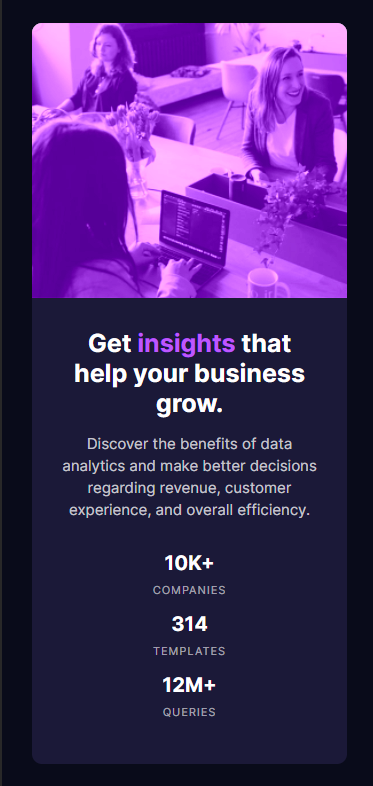
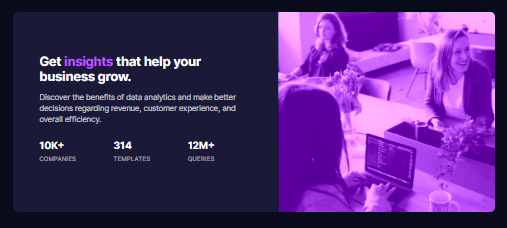

# Frontend Mentor - Stats preview card component solution

This is a solution to the [Stats preview card component challenge on Frontend Mentor](https://www.frontendmentor.io/challenges/stats-preview-card-component-8JqbgoU62). Frontend Mentor challenges help you improve your coding skills by building realistic projects.

## Table of contents

- [Overview](#overview)
  - [The challenge](#the-challenge)
  - [Screenshot](#screenshot)
  - [Links](#links)
- [My process](#my-process)
  - [Built with](#built-with)
  - [What I learned](#what-i-learned)
- [Author](#author)

## Overview

### The challenge

Users should be able to:

- View the optimal layout depending on their device's screen size

### Screenshot

<!-- <br>
 -->

<br>


### Links

- Solution URL: [Solution URL](https://www.frontendmentor.io/solutions/responsive-stats-card-using-css-flexbox-n9vt3mtRw)
- Live Site URL: [Live site URL](https://fmc-stats-card.vercel.app/)

## My process

### Built with

- Semantic HTML5 markup
- CSS custom properties
- Flexbox
- Mobile-first workflow

### What I learned
While working through this tiny project I decided to learn a little bit about CSS variables in order to simplify the workflow + reduce workload in the future, here is a small snippet as example of how I use them:

Global declaration
```css
:root{
    --bg-color: hsl(233, 47%, 7%);
    --card-bg: hsl(244, 38%, 16%);
    --violet: hsl(277, 100%, 67%);

    --main-white: hsl(0, 0%, 100%);
    --s-white: hsla(0, 0%, 100%, 0.75);
    --t-white: hsla(0, 0%, 100%, 0.6);

    --m-font: 'Inter';
    --s-font: 'Lexend Deca';
}
```
Sample of use
```css
h1{
    font-size: 25px;
    font-family: var(--m-font);
    font-weight: 700;
    margin-bottom: 15px;
    color: var(--main-white);   
}
```

## Author

- Frontend Mentor - [@fal3on](https://www.frontendmentor.io/profile/fal3on)
- Twitter - [@faleon_dev](https://twitter.com/faleon_dev)